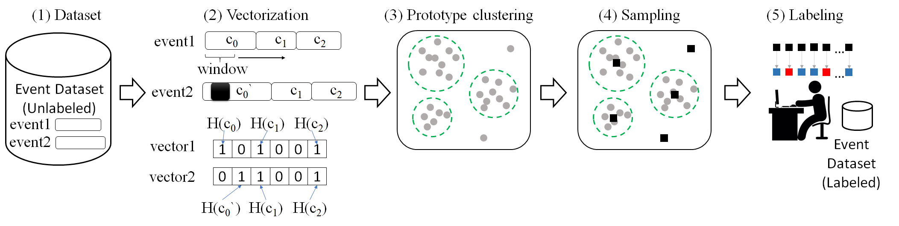

# SELID
SELID: Selective Event Labeling for Intrusion Detection Datasets([Sensors 23, no. 13: 6105.](https://www.mdpi.com/1424-8220/23/13/6105))

---
There are 5 hyperparameters. You can configure it by referring to `conf.py`.
